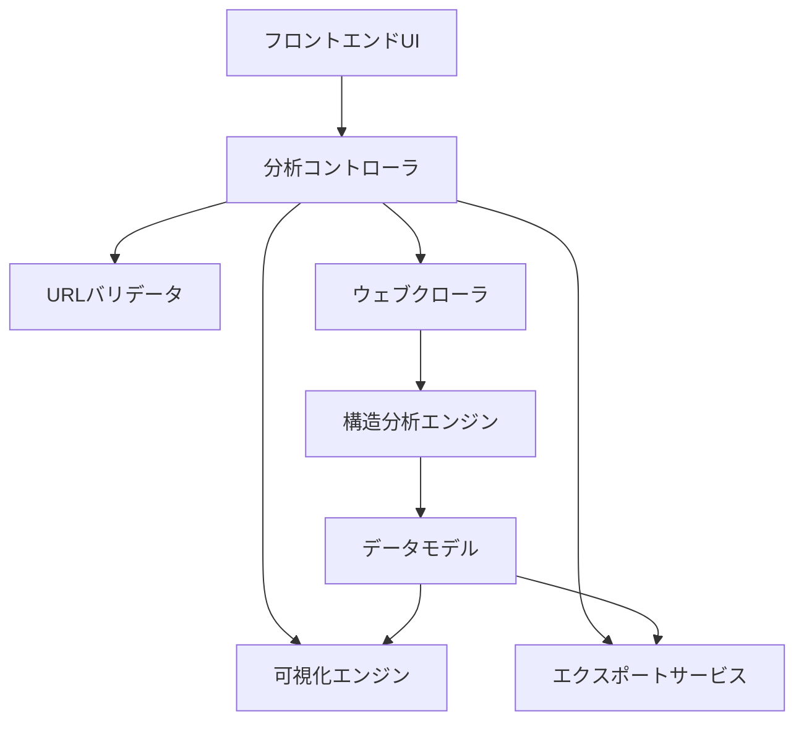
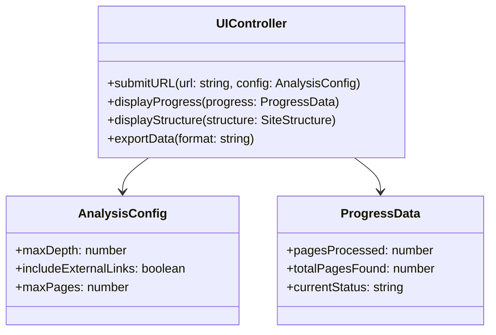
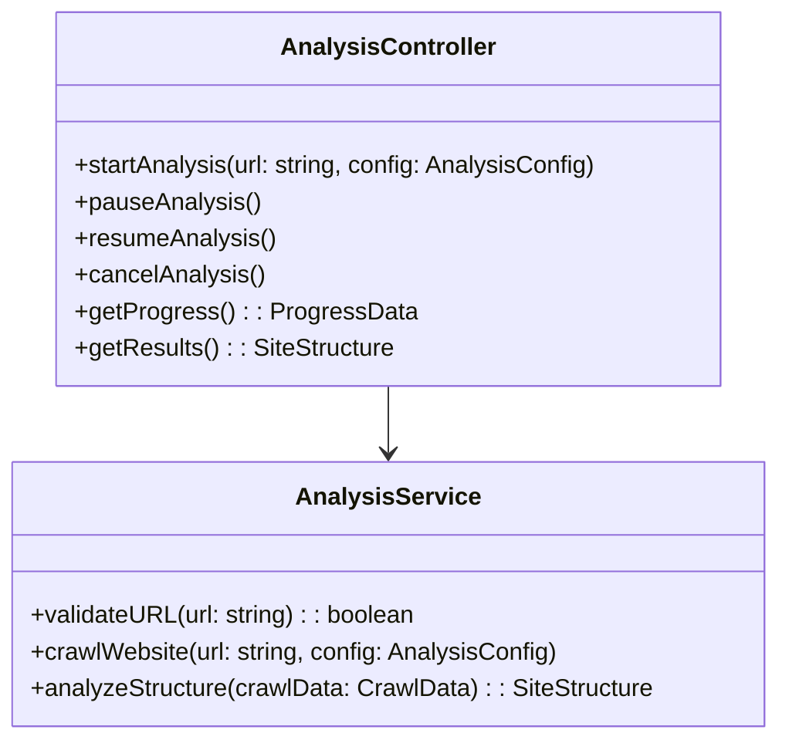
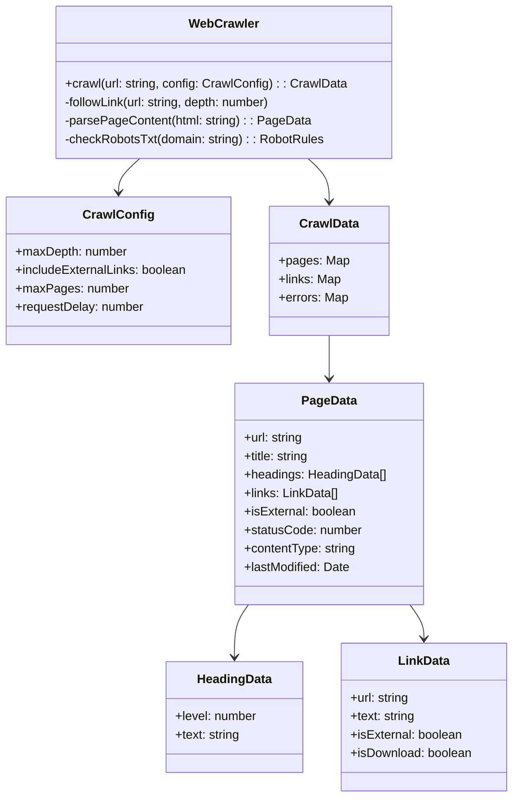
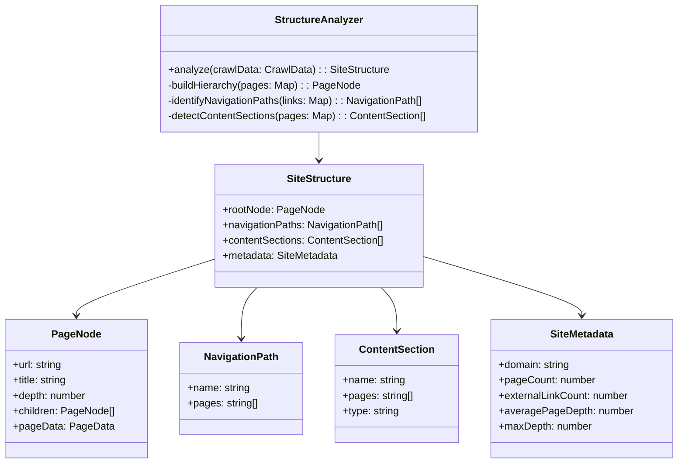
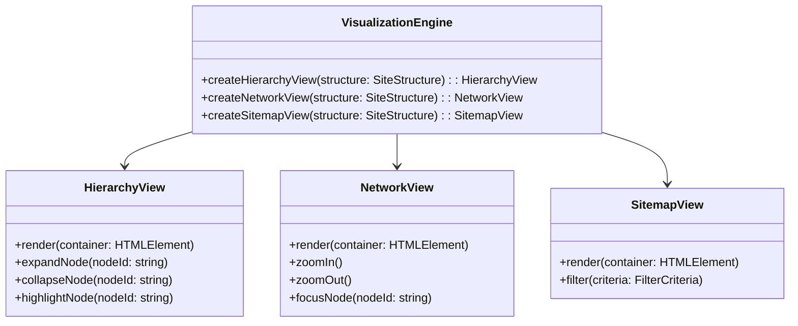
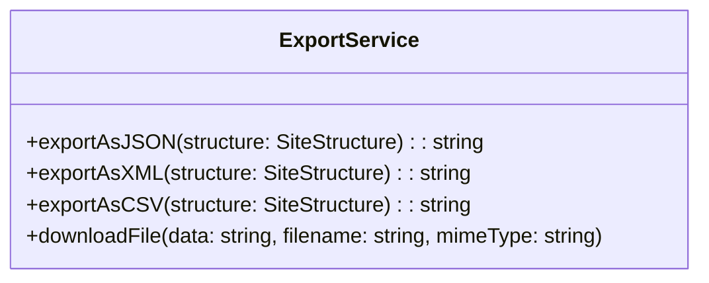
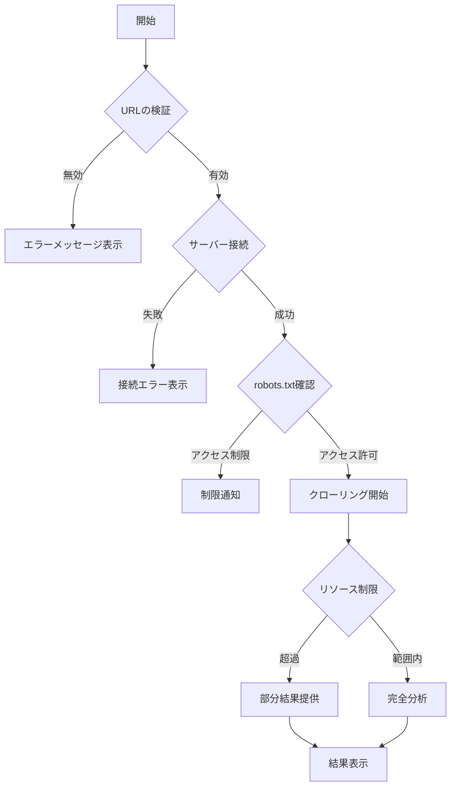

# 設計ドキュメント：ウェブサイト構造分析ツール

## 概要

ウェブサイト構造分析ツールは、ユーザーが提供したURLのウェブサイトを分析し、そのサイトの構造を視覚的に表現するシステムです。このツールは、ウェブクローリング技術を使用してサイトのページを探索し、それらの関係性を特定し、階層的な構造を生成します。ユーザーはこの情報を使用して、サイトの設計と構成を理解することができます。

## アーキテクチャ

システムは以下の主要コンポーネントで構成されます：



### コンポーネントの説明

1. **フロントエンドUI**：ユーザーがURLを入力し、分析設定を構成し、結果を表示するインターフェース。
2. **分析コントローラ**：全体のワークフローを調整し、各コンポーネント間の通信を管理。
3. **URLバリデータ**：入力されたURLの形式と可用性を検証。
4. **ウェブクローラ**：指定されたURLからウェブページを取得し、リンクを追跡して関連ページを発見。
5. **構造分析エンジン**：クロールされたデータを処理して構造的関係を特定。
6. **データモデル**：分析されたウェブサイト構造を表現するデータ構造。
7. **可視化エンジン**：データモデルを視覚的表現に変換。
8. **エクスポートサービス**：分析データを様々な形式でエクスポート。

## コンポーネントとインターフェース

### フロントエンドUI

フロントエンドUIは、以下の機能を提供します：

- URLの入力フォーム
- 分析設定オプション（クロール深度、外部リンク含有、最大ページ数など）
- 進捗表示
- 構造可視化表示
- エクスポートオプション



### 分析コントローラ

分析コントローラは、分析プロセスを調整し、以下のインターフェースを提供します：



### ウェブクローラとデータモデル

ウェブクローラは、ウェブサイトのページを取得し、以下のデータモデルを構築します：



### 構造分析エンジン

構造分析エンジンは、クロールデータを処理して構造的関係を特定します：



### 可視化エンジン

可視化エンジンは、サイト構造データを視覚的表現に変換します：



### エクスポートサービス

エクスポートサービスは、分析データを様々な形式でエクスポートします：



## データモデル

システムの主要なデータモデルは以下の通りです：

### ウェブサイト構造モデル

```json
{
  "siteMetadata": {
    "domain": "example.com",
    "pageCount": 42,
    "externalLinkCount": 15,
    "averagePageDepth": 2.3,
    "maxDepth": 5,
    "analysisDate": "2025-07-17T10:30:00Z"
  },
  "rootNode": {
    "url": "https://example.com/",
    "title": "Example Website",
    "depth": 0,
    "children": [
      {
        "url": "https://example.com/about",
        "title": "About Us",
        "depth": 1,
        "children": []
      },
      {
        "url": "https://example.com/products",
        "title": "Products",
        "depth": 1,
        "children": [
          {
            "url": "https://example.com/products/item1",
            "title": "Product Item 1",
            "depth": 2,
            "children": []
          }
        ]
      }
    ]
  },
  "navigationPaths": [
    {
      "name": "Main Navigation",
      "pages": [
        "https://example.com/",
        "https://example.com/about",
        "https://example.com/products",
        "https://example.com/contact"
      ]
    }
  ],
  "contentSections": [
    {
      "name": "Blog",
      "pages": [
        "https://example.com/blog/post1",
        "https://example.com/blog/post2"
      ],
      "type": "blog"
    }
  ]
}
```

## エラー処理

システムは以下のエラーシナリオを処理します：

1. **無効なURL**：URLの形式が無効な場合、具体的なエラーメッセージを表示。
2. **アクセス不能なURL**：サーバーが応答しない、または存在しないドメインの場合、接続エラーを表示。
3. **クロール制限**：robots.txtによるアクセス制限がある場合、制限を尊重し、ユーザーに通知。
4. **リソース制限**：分析が時間またはリソース制限を超えた場合、部分的な結果を提供し、ユーザーに通知。
5. **認証要求**：保護されたページに遭遇した場合、そのページをスキップし、構造内で「保護されたコンテンツ」としてマーク。

エラー処理フロー：



## テスト駆動開発（TDD）アプローチ

このプロジェクトはテスト駆動開発（TDD）の原則に従って実装されます。TDDサイクルは以下の通りです：

1. **赤（Red）**: 失敗するテストを書く
2. **緑（Green）**: テストが通るように最小限のコードを書く
3. **リファクタリング（Refactor）**: コードを改善しながらテストが通ることを確認する

このサイクルを繰り返すことで、要件を満たす高品質なコードを段階的に構築します。

### テスト自動化フレームワーク

- **バックエンド**: Jest/Mocha + Chai
- **フロントエンド**: Vitest + React Testing Library
- **E2Eテスト**: Cypress

### テスト環境

- **開発環境**: ローカル開発サーバーでの継続的テスト
- **CI環境**: GitHub Actionsを使用した自動テスト
- **モック環境**: テスト用のモックサーバーとテストデータ

### テストレベル

#### 1. ユニットテスト

- **URLバリデータ**：様々なURLフォーマットのテスト
- **ウェブクローラ**：モックHTTPレスポンスを使用したクローリングロジックのテスト
- **構造分析エンジン**：既知の入力データに対する構造分析のテスト
- **可視化コンポーネント**：レンダリングロジックのテスト

#### 2. 統合テスト

- クローラと分析エンジンの統合
- 分析エンジンと可視化エンジンの統合
- フロントエンドUIと分析コントローラの統合

#### 3. エンドツーエンドテスト

- 既知のテストサイトに対する完全な分析プロセスのテスト
- 様々な構造と複雑さを持つサイトのテスト
- エラーシナリオと回復メカニズムのテスト

#### 4. パフォーマンステスト

- 大規模サイトに対するクローリング性能のテスト
- 並列処理の効率性テスト
- メモリ使用量と最適化のテスト

### 継続的検証システム

要件定義に対する継続的な検証を行うために、以下のシステムを実装します：

1. **要件トレーサビリティマトリックス**：各テストが特定の要件をカバーしていることを確認するマトリックス
2. **自動検証レポート**：テスト実行後に要件の充足度を自動的に評価するレポート
3. **回帰テストスイート**：新機能追加時に既存機能が壊れていないことを確認するテストスイート

### フィードバックループ

1. **テスト結果分析**：失敗したテストの原因を特定
2. **修正計画**：問題を解決するための修正計画を立案
3. **実装と検証**：修正を実装し、テストで検証
4. **ドキュメント更新**：必要に応じて設計ドキュメントを更新

このアプローチにより、要件定義から実装、検証までの一貫したプロセスを確立し、高品質なソフトウェアを継続的に提供します。