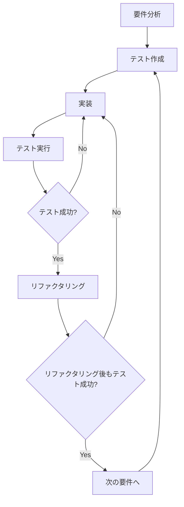

# TDD実装フレームワーク

## 概要

このドキュメントでは、ウェブサイト構造分析ツールをテスト駆動開発（TDD）で実装するためのフレームワークを定義します。このフレームワークは、要件定義から実装、検証までの一貫したプロセスを確立し、継続的な評価・チェック・修正・確認のサイクルを実現します。

## TDD実装サイクル



## 開発環境構成

### 1. プロジェクト構造

```
website-structure-analyzer/
├── .github/
│   └── workflows/           # CI/CD設定
├── backend/
│   ├── src/                 # バックエンドソースコード
│   ├── tests/               # バックエンドテスト
│   │   ├── unit/           # ユニットテスト
│   │   ├── integration/    # 統合テスト
│   │   └── e2e/            # E2Eテスト
│   └── jest.config.js      # Jestの設定
├── frontend/
│   ├── src/                # フロントエンドソースコード
│   ├── tests/              # フロントエンドテスト
│   │   ├── unit/          # ユニットテスト
│   │   └── component/     # コンポーネントテスト
│   └── vitest.config.js   # Vitestの設定
├── shared/                 # 共有コード
├── tests/
│   ├── e2e/               # E2Eテスト
│   └── fixtures/          # テスト用データ
└── docker-compose.yml     # 開発環境設定
```

### 2. テストフレームワーク

- **バックエンド**: Jest + SuperTest
- **フロントエンド**: Vitest + React Testing Library
- **E2E**: Cypress
- **カバレッジ**: Istanbul

### 3. 継続的インテグレーション

- **GitHub Actions**を使用した自動テスト
- プルリクエスト時に全テストを実行
- テストカバレッジレポートの自動生成

## 要件検証システム

### 1. 要件トレーサビリティマトリックス

各テストと要件の対応関係を管理するマトリックスを作成します。

```
| 要件ID | 要件説明 | テストファイル | テスト状態 |
|--------|----------|----------------|------------|
| 1.1    | URL検証  | url.test.js    | ✅ Pass    |
```

### 2. テスト駆動開発プロセス

#### ステップ1: 要件分析

1. 要件を小さな実装可能な単位に分解
2. 各要件に対する受け入れ基準を明確化
3. 要件IDを割り当て

#### ステップ2: テスト作成

1. 要件に基づいて失敗するテストを作成
2. テストファイル名に要件IDを含める
3. テストコメントに対応する要件を記述

```javascript
// Test for Requirement 1.1: URL Validation
describe('URL Validator (Req 1.1)', () => {
  test('should validate correct URL format', () => {
    // ...
  });
});
```

#### ステップ3: 実装

1. テストが通るように最小限のコードを実装
2. コードにコメントで対応する要件IDを記述

```javascript
// Implements Requirement 1.1: URL Validation
function validateUrl(url) {
  // ...
}
```

#### ステップ4: テスト実行と検証

1. 自動テストを実行
2. テスト結果を分析
3. 要件トレーサビリティマトリックスを更新

#### ステップ5: リファクタリング

1. コードの品質を改善
2. テストが引き続き通ることを確認

### 3. 継続的検証システム

#### 自動テスト実行

```bash
# バックエンドテスト実行
cd backend && npm test

# フロントエンドテスト実行
cd frontend && npm test

# E2Eテスト実行
npm run test:e2e

# 全テスト実行
npm test
```

#### テストレポート生成

- テスト結果レポート
- カバレッジレポート
- 要件充足度レポート

## モックとスタブ

### 1. テスト用モックサーバー

実際のウェブサイトをクロールする代わりに、テスト用のモックサーバーを使用します。

```javascript
// モックサーバーの設定
const mockServer = setupMockServer([
  {
    url: 'https://example.com',
    content: '<html><body><a href="/about">About</a></body></html>'
  },
  {
    url: 'https://example.com/about',
    content: '<html><body><h1>About Us</h1></body></html>'
  }
]);
```

### 2. テストデータ

様々なウェブサイト構造をシミュレートするテストデータを用意します。

```javascript
// テストデータの例
const testSites = {
  simple: {
    pages: [
      { url: '/', links: ['/about', '/contact'] },
      { url: '/about', links: ['/'] },
      { url: '/contact', links: ['/'] }
    ]
  },
  complex: {
    // 複雑なサイト構造
  },
  error: {
    // エラーケース
  }
};
```

## 評価・チェック・修正・確認サイクル

### 1. 自動評価

各テスト実行後に、以下の評価を自動的に行います：

- テスト成功率
- コードカバレッジ
- 要件充足度
- パフォーマンスメトリクス

### 2. 問題特定

失敗したテストから問題を特定します：

- テストエラーメッセージの分析
- 関連するコードの特定
- 要件との不一致の特定

### 3. 修正計画

問題に基づいて修正計画を立案します：

- 優先度の決定
- 修正アプローチの選択
- 影響範囲の評価

### 4. 実装と確認

修正を実装し、再テストで確認します：

- 修正の実装
- 回帰テストの実行
- 要件充足度の再評価

## 実装例

### テスト例: URLバリデータ

```javascript
// tests/unit/urlValidator.test.js
import { validateUrl } from '../../src/utils/urlValidator';

describe('URL Validator (Req 1.1)', () => {
  test('should validate correct URL format', () => {
    expect(validateUrl('https://example.com')).toBe(true);
    expect(validateUrl('http://sub.example.com/path')).toBe(true);
  });

  test('should reject invalid URL format', () => {
    expect(validateUrl('not-a-url')).toBe(false);
    expect(validateUrl('http:/example.com')).toBe(false);
  });

  test('should handle edge cases', () => {
    expect(validateUrl('')).toBe(false);
    expect(validateUrl('https://localhost:3000')).toBe(true);
  });
});
```

### 実装例: URLバリデータ

```javascript
// src/utils/urlValidator.js

/**
 * Validates if the input is a properly formatted URL
 * Implements Requirement 1.1
 * 
 * @param {string} url - The URL to validate
 * @returns {boolean} - True if URL is valid, false otherwise
 */
export function validateUrl(url) {
  try {
    const urlObj = new URL(url);
    return urlObj.protocol === 'http:' || urlObj.protocol === 'https:';
  } catch (e) {
    return false;
  }
}
```

## まとめ

このTDD実装フレームワークを使用することで、以下の利点が得られます：

1. 要件と実装の一貫性の確保
2. 高品質なコードの継続的な提供
3. 問題の早期発見と修正
4. 開発プロセスの透明性の向上
5. 継続的な改善サイクルの確立

このフレームワークに従って開発を進めることで、要件定義通りに動作するアプリケーションを効率的に構築できます。